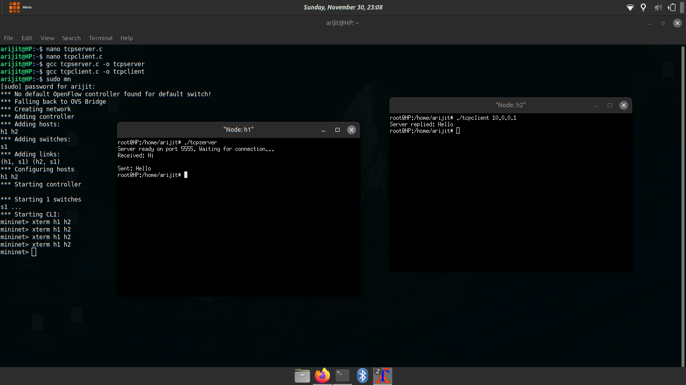

CN Lab – Assignment 1 Objective: To gain first hands on experience of basic Socket Programming.

Exercise: Write a program to run TCP client and server socket programs where client first says "Hi" and in response server says "Hello".

Steps/ Hints: (if any):

    Create two mininet hosts,
    Open the hosts individually in xterm windows,
    In one host, run tcpserver program and then in another run the tcpclient.

Learning Outcomes:

    Basics of TCP client and server programming.

OUTPUT SCREENSHOT

