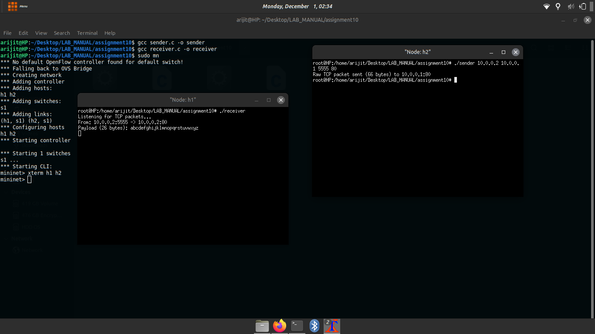

CN Lab – Assignment 10
Objective

Using RAW sockets to generate packets.
Exercise

Write two C programs using raw socket to send:

    TCP packet where TCP payload will contain your roll number
    ICMP time stamp messages towards a target IP

Steps/Hints

    Use RAW socket to create your TCP packet with user given header and payload
    Use the suitable ICMP message type to create timestamp messages
    Receiver of the ICMP message must display the packet in wireshark

Output Screenshots

