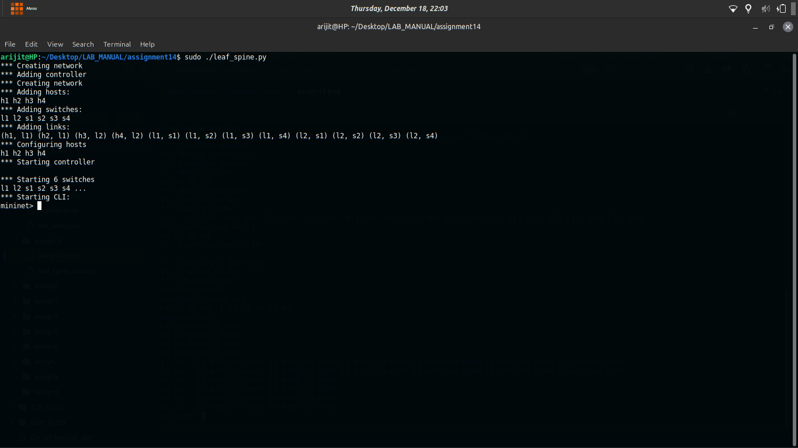

CN Lab – Assignment 14
Objective

Creating customized topologies in mininet.
Exercise

Create a custom leaf-spine topology in mininet using python which can be scaled with increasing switch radix.
Steps/Hints

    Write your suitable python code using mininet API
    A reference of fattree topology may be taken

Output Screenshots

