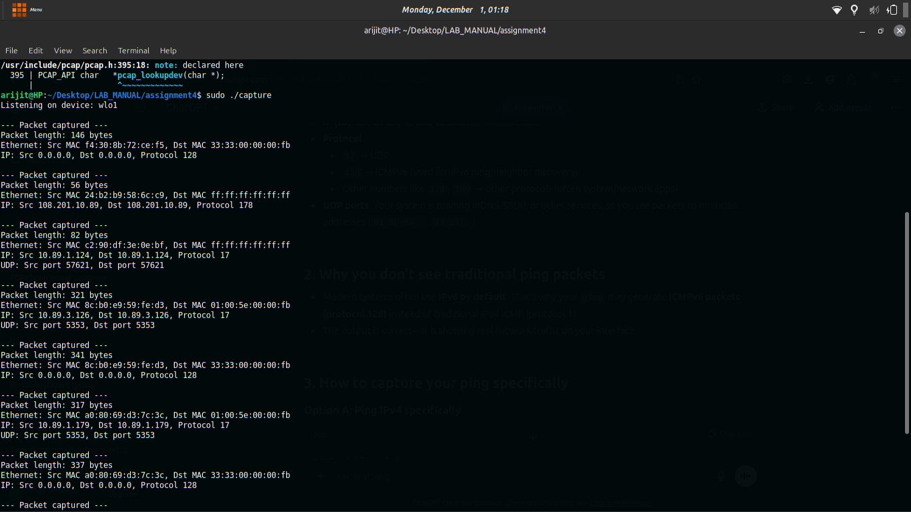

Assignment 4: Objective: To gain knowledge of packet capturing tools and understand header structures.

Exercise: Install wireshark in a VM (Virtual Machine) environment. Draw a time diagram to show the steps in the protocols recorded in the captured file (saved in the .pcap file of wireshark) during a PING operation. List the L2, L3, L4 header fields that can be extracted from the .pcap file.

Steps/ Hints: (if any)

    Install wireshark in your linux vm with mininet,
    Start capturing at any interface,
    Ping any two hosts,
    Analyze.

Learning Outcomes:

    Knowledge of packet capturing tools, protocols and headers.

Output Screenshots

