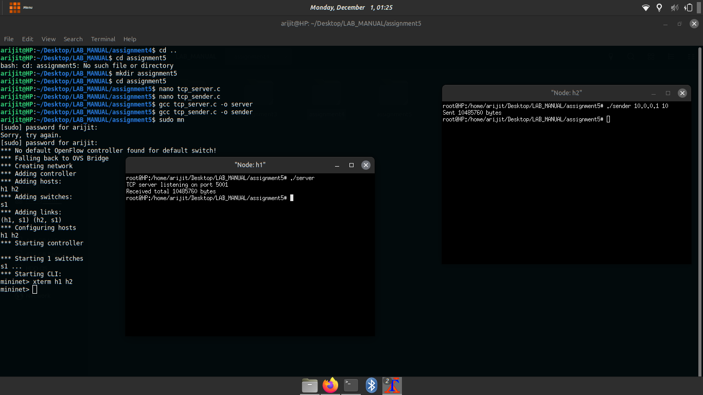

Assignment 5 Objective: To gain knowledge of more packet capturing tools.

Exercise: Learn and use maximum number of packet generation tools.

Steps/ Hints: (if any)

    Install Iperf, D-ITG etc. and send traffic among mininet hosts.

Learning Outcomes:

    Knowledge of packet generation and capturing tools.

Output Screenshots

